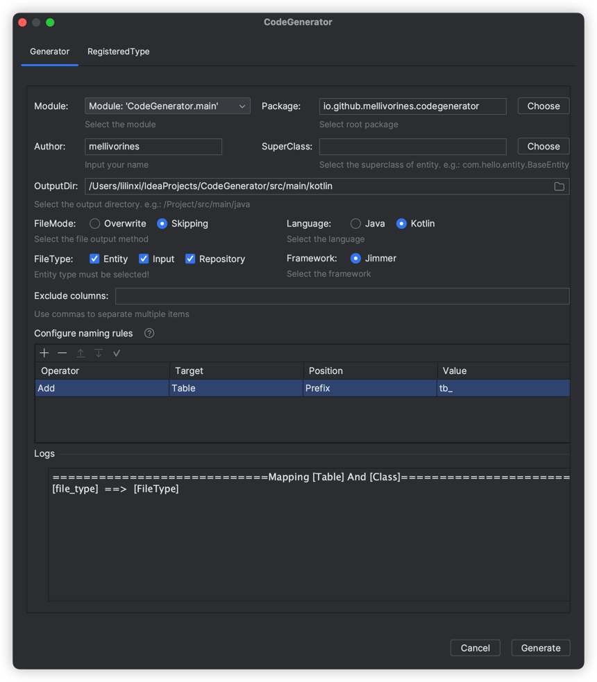
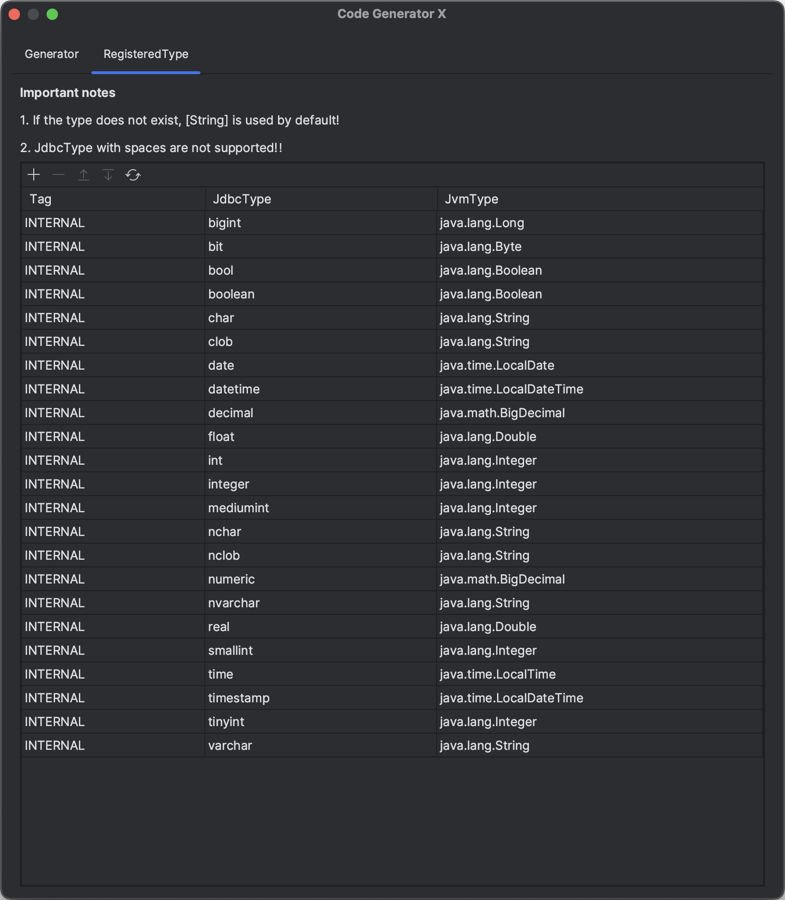

CodeGenerator
---
> Code generation plug-in based on database table

####  project based
[CodeGenX](https://github.com/huyaro/CodeGenX.git)

#### Support Features
- generate code for entity、input and repository
- support framework: jimmer
- support language: java, kotlin

#### Screenshot
- Generator

- RegisteredType

